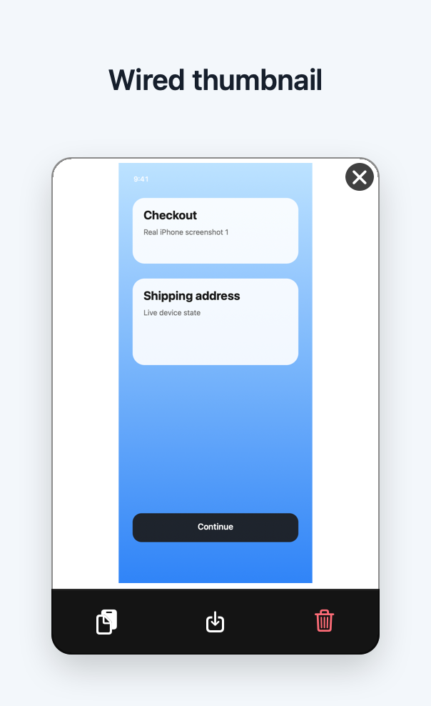
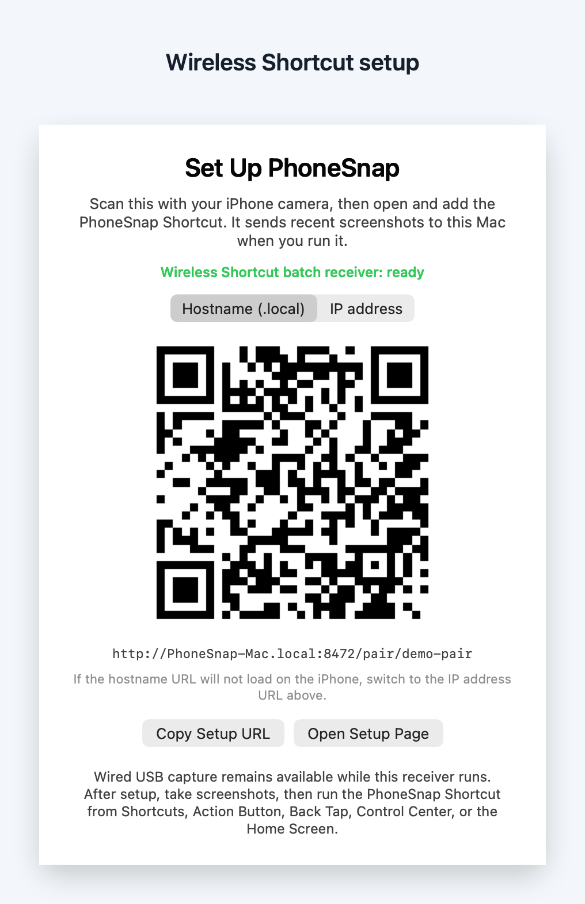
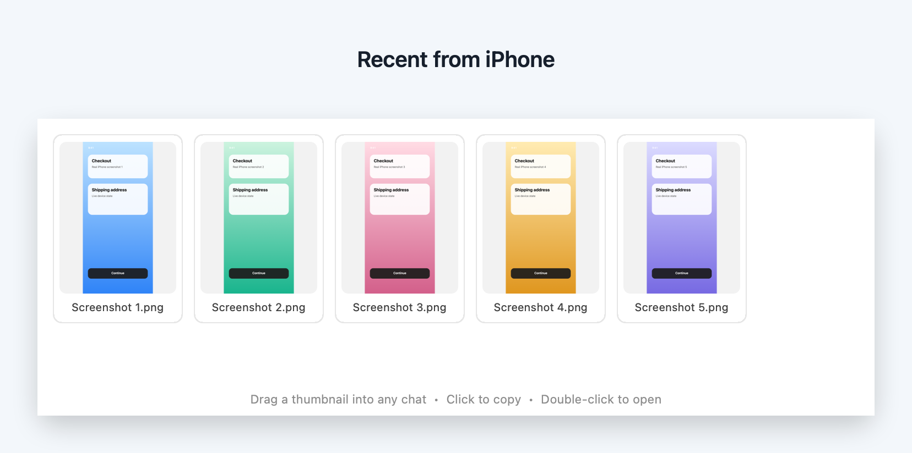

# PhoneSnap

Drag real phone screenshots into your coding agent.

PhoneSnap is a small macOS menu bar app for AI-assisted mobile work. It receives new screenshots automatically from a trusted USB iPhone, captures an Android display through ADB on demand, or accepts an iOS Shortcut batch over Wi-Fi, then turns the images into draggable Mac thumbnails.

The goal is simple: when your agent needs to understand a broken layout, a weird state, or a real-device visual bug, you should be able to take a screenshot and drop it straight into Codex, Cursor, Claude, ChatGPT, Slack, or an issue.

## What It Looks Like

The sample screenshots below are rendered from PhoneSnap's real AppKit views with generated phone-screen content, so they show the app without exposing anyone's device data.

| Screenshot arrives | Wireless setup |
|--------------------|----------------|
| Take a screenshot on the iPhone. PhoneSnap saves it, copies it, and shows a draggable thumbnail with quick actions. | If USB is not available, scan the setup QR once and install the generated Shortcut on the iPhone. |
|  |  |

When the Shortcut sends several screenshots, PhoneSnap keeps a **Recent from iPhone** strip open so each image can be dragged into an agent one by one.



## How You Use It

1. Run PhoneSnap on the Mac.
2. Take a screenshot on a real iPhone.
3. Drag the thumbnail into your agent chat or issue.
4. Ask for the fix with the real UI in view.

USB iPhone is the primary automatic path because macOS exposes a trusted plugged-in iPhone as a camera-class device through ImageCaptureCore. Android uses an explicit menu action backed by ADB, while the wireless iOS Shortcut remains a manual fallback for times when USB is inconvenient.

For Android, put the desired UI on screen and choose **Capture Android Screen**
from the Mac menu instead of step 2.

## Requirements

- macOS 13+
- Swift 5.9+ / Xcode 15+ to build
- iPhone or iPad that appears to macOS through ImageCaptureCore
- Optional Android device with USB debugging and Android SDK Platform Tools (`adb`)
- USB or USB-C cable for wired mode
- Same Wi-Fi/LAN for wireless Shortcut mode

## Quick Start

Download the latest `PhoneSnap.zip` from [Releases](https://github.com/Aqu1bp/PhoneSnap/releases/latest), unzip it, then open `PhoneSnap.app`.

PhoneSnap is not notarized yet, so macOS may block the first launch. If that happens, right-click `PhoneSnap.app`, choose **Open**, then confirm.

To build from source instead:

```bash
git clone https://github.com/Aqu1bp/PhoneSnap.git
cd PhoneSnap
./scripts/build-app.sh
open ./PhoneSnap.app
```

A small iPhone icon appears in the menu bar. The app is running.

## Capture Modes

### Wired USB

1. Plug your iPhone into the Mac.
2. Unlock the iPhone.
3. If prompted, tap **Trust This Computer**.
4. Take a screenshot on the iPhone.
5. Drag the Mac thumbnail into Codex, Cursor, Claude, ChatGPT, Slack, or wherever the agent can see images.

Behind the scenes, PhoneSnap uses Apple's ImageCaptureCore framework. macOS exposes a trusted, plugged-in iPhone as a camera-class device, so PhoneSnap can watch for new camera-roll items after startup, filter likely screenshots, save them locally, copy them to the clipboard, and show the thumbnail.

### Android with ADB

1. Install Android SDK Platform Tools and enable USB debugging on the phone.
2. Connect and authorize the phone; confirm it appears in `adb devices -l`.
3. Open the PhoneSnap menu and choose **Capture Android Screen**.
4. Drag or paste the resulting Mac thumbnail.

PhoneSnap invokes `adb -s <serial> exec-out screencap -p` directly, without a shell, and feeds the PNG into the same local save, pasteboard, and thumbnail pipeline as wired iPhone images. Multiple connected Android devices appear in a submenu. See [Android setup](docs/ANDROID_SETUP.md) for installation, wireless-debugging, and troubleshooting details.

### Wireless Shortcut Batch Fallback

1. Open the PhoneSnap menu bar item.
2. Choose **Set Up Wireless Shortcut...**.
3. Scan the setup QR code with the iPhone Camera, or copy/open the setup URL. If the `.local` hostname will not load on your network, switch the QR to **IP address** in the setup window.
4. On the iPhone, open `PhoneSnap.shortcut` and add it in Shortcuts.
5. Take a screenshot, then run the PhoneSnap Shortcut from Shortcuts, Action Button, Back Tap, Control Center, or the Home Screen.

The Shortcut is generated locally by the Mac app. It asks Photos for the latest screenshot batch (10 by default, configurable with `PHONESNAP_BATCH_COUNT`) and posts each image to `POST /api/v1/upload/<pairId>` with a persisted bearer token, so the user does not type the URL, method, headers, or body. As uploads arrive, PhoneSnap updates the floating **Recent from iPhone** panel with draggable thumbnails. This remains useful when USB is unavailable.

Existing installed PhoneSnap Shortcuts should be removed and reinstalled from the setup page to get batch behavior.

## What Is Supported

- Primary path: a trusted iPhone connected to the Mac over USB.
- Supported Android path: user-triggered capture through an authorized USB or wireless ADB connection.
- Fallback path: a locally generated, signed iOS Shortcut that sends a screenshot batch over the LAN.
- Deprecated/experimental: automatic wireless senders embedded in the foreground app being built.
- Deliberately not used: GitHub Gist rendezvous, third-party services, iCloud, or manual Shortcut URL/header/body entry.

The `senders/` packages are deprecated as a main product path for now. They are kept as experimental references for foreground-app debug builds that post directly to the Mac upload endpoint. The menu no longer exposes a happy-path dev sender config action.

## Single Thumbnail Behavior

USB iPhone arrivals and Android ADB captures share this behavior:

- Appears bottom-right of the screen containing the cursor.
- Auto-copies the screenshot to the clipboard on arrival.
- Shows action buttons for copy (⌘C), save to Downloads (⌘S), and delete to Trash (⌘⌫). Click the image to open it in Preview.
- Drag the image directly into agent apps, chat apps, issue trackers, or any file drop target.
- Press ESC or click the close button to dismiss.
- Auto-fades after 8 seconds; hovering resets the timer.

## Wireless Batch Behavior

- Wireless Shortcut uploads do not show the wired single thumbnail by default.
- The Mac opens a floating **Recent from iPhone** panel immediately and updates it as more screenshots arrive.
- Each panel thumbnail can be dragged into agent apps and file drop targets.
- Click a panel thumbnail to copy it to the clipboard.
- Double-click a panel thumbnail to open it in Preview.
- The latest wireless upload is also written to the pasteboard for paste workflows.

## Where Screenshots Are Saved

By default:

```text
~/Pictures/PhoneSnap/Screenshot YYYY-MM-DD at HH.MM.SS.SSS.png
```

Override the folder when launching:

```bash
PHONESNAP_DIR=~/Desktop/screenshots open ./PhoneSnap.app
```

## Run Commands

| Goal | Command |
|------|---------|
| Build + launch | `./scripts/build-app.sh && open ./PhoneSnap.app` |
| Run from source with logs | `swift run PhoneSnap` |
| Run the debug binary | `.build/debug/PhoneSnap` |
| Stop the app | Menu bar item -> Quit, or `pkill -f PhoneSnap` |
| Change save folder | `PHONESNAP_DIR=~/wherever open ./PhoneSnap.app` |
| Change wireless port | `PHONESNAP_WIRELESS_PORT=18472 open ./PhoneSnap.app` |
| Change Shortcut batch size (1-50, default 10) | `PHONESNAP_BATCH_COUNT=20 open ./PhoneSnap.app`, then re-download and re-add the Shortcut |
| Use ADB from a custom location | `PHONESNAP_ADB_PATH=/path/to/adb open ./PhoneSnap.app` |

## How It Works

```text
iPhone over USB
  screenshot saved to camera roll
    -> ImageCaptureCore didAdd callback
    -> PhoneSnap downloads the new item
    -> saves PNG to ~/Pictures/PhoneSnap
    -> writes PNG/TIFF/file URL to NSPasteboard
    -> shows a floating NSPanel thumbnail

Android over USB or ADB Wi-Fi
  user chooses Capture Android Screen
    -> PhoneSnap selects the authorized ADB device
    -> adb exec-out screencap -p streams a PNG
    -> Mac saves and copies the PNG
    -> Mac shows the same floating single-thumbnail panel

iPhone over Wi-Fi
  user runs generated PhoneSnap Shortcut
    -> Shortcut reads the latest screenshot batch from Photos
    -> repeats over the screenshots
    -> POSTs each image to the Mac receiver with Authorization: Bearer <token>
    -> Mac saves each PNG, updates pasteboard to the latest upload
    -> Mac shows the Recent from iPhone batch panel

iPhone over Wi-Fi experimental
  foreground app includes deprecated debug PhoneSnap sender
    -> sender snapshots its active app UI
    -> POSTs raw PNG to the Mac receiver with Authorization: Bearer <token>
```

## Troubleshooting

| Symptom | Fix |
|---------|-----|
| Nothing appears after taking a screenshot | Unlock the iPhone, reconnect the cable, and accept **Trust This Computer** if prompted. |
| Android says `adb not found` | Install Android SDK Platform Tools or set `PHONESNAP_ADB_PATH` to the executable. |
| Android says authorization is needed | Unlock the phone and accept **Allow USB debugging**, then reopen the menu. |
| Android device is offline | Reconnect USB or reconnect its wireless ADB session; verify `adb devices -l` says `device`. |
| Dragging into an agent does not attach the image | Use the copy button or paste with Command-V; PhoneSnap writes PNG, TIFF, and file URL pasteboard types. |
| Old photos appear | Quit and reopen the app, then take a fresh screenshot. |
| Clipboard paste fails | Use the thumbnail copy button; if it still fails, run from terminal with `swift run PhoneSnap` and check logs. |
| App does not launch | Rebuild with `./scripts/build-app.sh`. |
| Thumbnail appears on the wrong display | Move the mouse to the target display before taking the screenshot. |
| Wireless setup page does not load | Keep the Mac app running and put both devices on the same LAN. If macOS asked about incoming connections, allow PhoneSnap in System Settings → Network → Firewall. If the `.local` name will not resolve, switch the setup window QR to **IP address**. |
| Wireless receiver is unavailable | Another process may be using the port. Quit the other process or relaunch with `PHONESNAP_WIRELESS_PORT=<port>`. Wired mode should still work. |
| Shortcut used to work but now fails silently | If it was installed from the IP address URL, the Mac's IP likely changed. Rerun setup and re-add the Shortcut; prefer the `.local` hostname URL when it loads. |
| Shortcut runs but nothing appears on the Mac | Confirm screenshots exist in Photos, both devices are on the same LAN, and Shortcuts has local-network permission (iPhone Settings → Privacy & Security → Local Network). |
| Shortcut download fails | Run from terminal with `swift run PhoneSnap`; the setup route reports `/usr/bin/shortcuts sign` errors instead of crashing. If signing fails or times out on a fresh Mac, open the Shortcuts app once and retry. |

## Known Limitations

- Wired USB remains the primary supported path.
- Android ADB capture is user-triggered; pressing Android's hardware screenshot buttons does not notify PhoneSnap portably.
- PhoneSnap does not bundle ADB or enable Developer options/USB debugging for the user.
- Shortcut wireless is manual-triggered and remains a fallback.
- Existing installed Shortcuts need reinstall to get the latest batch upload behavior.
- Dev senders are deprecated/experimental and no longer exposed in the main menu.
- Wireless requires the Mac app to be running and reachable from the iPhone on the local network.
- Shortcut signing depends on `/usr/bin/shortcuts sign --mode anyone`.
- Single-capture mode shows one thumbnail at a time. A new iPhone USB or Android ADB image dismisses the old thumbnail.
- Screenshot detection uses dimensions/aspect-ratio heuristics to avoid importing normal camera photos.
- No app sandbox and no notarization. First launch may require right-click -> Open or removing quarantine metadata.
- No automated phone end-to-end test; full verification requires a real trusted iPhone or authorized Android device.

## Project Layout

```text
PhoneSnap/
├── .github/                       CI, issue templates, repo automation
├── docs/                          architecture, research notes, test plan
│   ├── ANDROID_SETUP.md           ADB installation and device setup
│   └── PROTOCOL.md                stable cross-platform upload contract
├── senders/                       debug embedded sender references
│   ├── apple-ios                  native UIKit Swift Package
│   ├── expo                       Expo prototype
│   ├── react-native               intended API stub
│   └── flutter                    intended API stub
├── Sources/PhoneSnap/             macOS menu bar app
│   ├── AppDelegate.swift          app lifecycle and delivery pipeline
│   ├── ADBDevice.swift            Android device parsing and adb discovery
│   ├── ADBProcessRunner.swift     bounded, timeout-safe subprocess runner
│   ├── AndroidADBBridge.swift     Android polling and screen capture
│   ├── CameraBridge.swift         ImageCaptureCore USB watcher
│   ├── ImageStore.swift           save received bytes as PNG
│   ├── Pasteboard.swift           multi-type clipboard write
│   ├── StatusItemController.swift menu bar item
│   ├── WirelessReceiver.swift     local HTTP setup/upload receiver
│   ├── WirelessBatchPresenter...   Recent from iPhone batch panel
│   ├── WirelessSetupWindow...     setup QR/window UI
│   ├── WirelessShortcut...        signed Shortcut generation
│   ├── ThumbnailPresenter.swift   wires saved image to thumbnail window
│   ├── ThumbnailWindowController  borderless floating NSPanel
│   ├── ThumbnailView.swift        image view, actions, drag-out
│   └── Log.swift                  stderr logging
├── Sources/ICProbe/               ImageCaptureCore probe utility
├── Sources/UsbmuxdProbe/          usbmuxd probe utility
├── Tests/PhoneSnapTests/          ADB parser, resolver, process, and bridge tests
├── scripts/build-app.sh           wraps the SwiftPM binary into PhoneSnap.app
├── scripts/smoke-test.sh          wireless receiver smoke test used by CI
├── Package.swift
├── README.md
└── ROADMAP.md
```

## Security

Wireless mode runs a plain-HTTP receiver on your LAN, protected by a random pair ID and bearer token. Read [SECURITY.md](SECURITY.md) for the threat model before using it on shared networks. Wired mode opens no network listeners.

## Contributing

See [CONTRIBUTING.md](CONTRIBUTING.md) and [ROADMAP.md](ROADMAP.md). Small, focused PRs that improve reliability around real-device capture are especially useful.

## License

[MIT](LICENSE)
